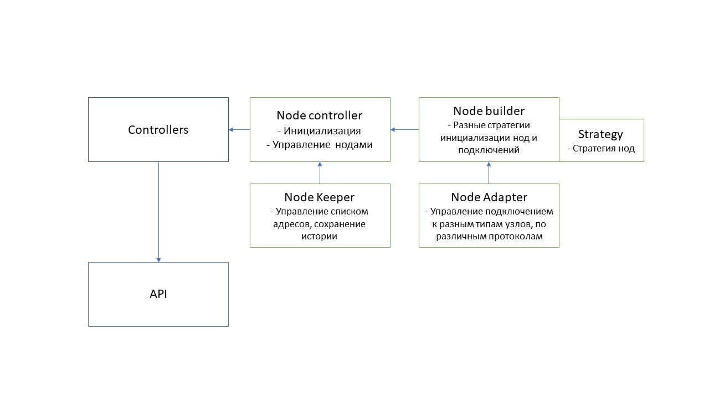

https://gist.github.com/hrls/67d1cdbc9ac027436923aeb53099efe2
--------------------------------------

Реализация предполагает создание многослойной архитектуры приложения, каждый модуль должен выполнять свою задачу. Задача: получить слабо-связанную модульную систему, которая будет достаточно устойчива и доступна для расширения. Это решение является исследовательским, некоторые части системы (например работа с БД) пропущены намеренно.

#### Общие рекомендации:
- модуль базы данных
- работа с базой данных в многопоточном режиме.
- выделение дополнительных слоев, абстракций
- снижение уровня связей
- расширение функциональных возможностей системы
- перехват ошибок, обработка исключений

#### Блок-схема

